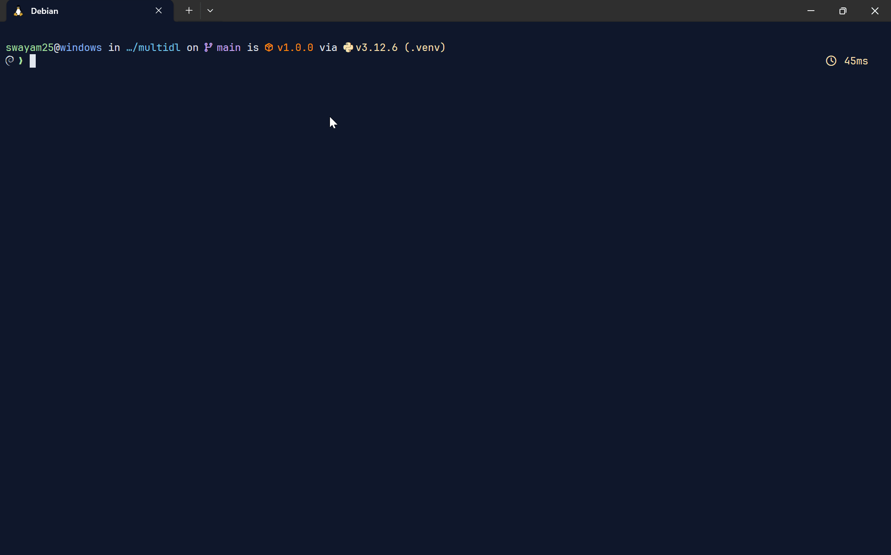
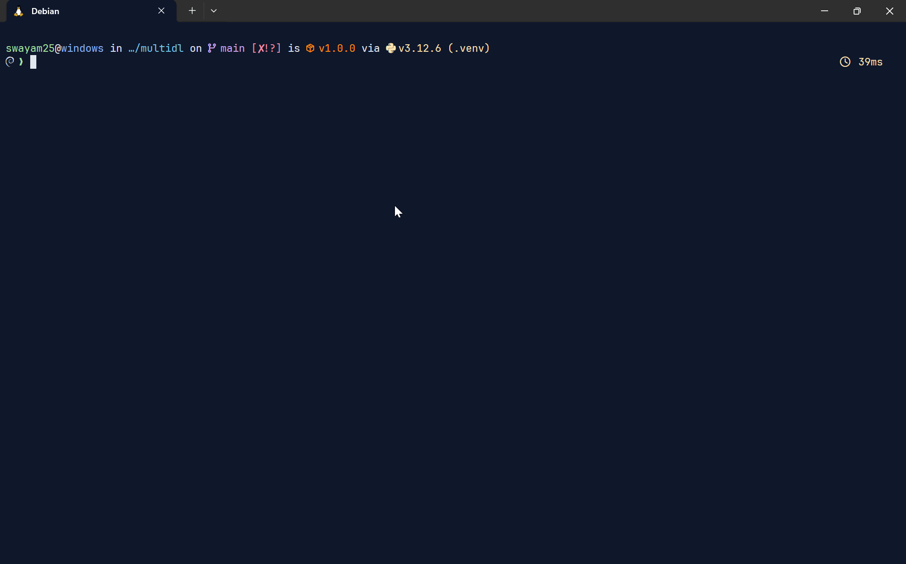

<div align="center">


A multimedia downloader which can download any video, music, playlist, album etc via link, keywords etc

</div>

## 🎬️ Preview

- **Fetch Info**

    

- **Download Spotify Playlist**

    

- **Download Only Audio from Videos on YouTube**

    

## 🎯 Features

- Supports `YouTube` & `Spotify`
- Obtain information about any video, music, playlist, album, etc
- Download any video, music, playlist, album, etc
- Supports a search system for downloading and obtaining information

## 🚀 Installation

> [!IMPORTANT]
> You must have `FFmpeg` installed on your system. You can download it from [here](https://ffmpeg.org/download.html).

- **Supported OS:** Windows, Linux, MacOS
- **Preferred OS:** Linux
- **Supported Python version:** 3.10 or higher
- Build from source
    ```sh
    pip install git+https://github.com/swayam25/Multi-DL
    ```

> [!TIP]
> If you are using `virtual environment` (`venv`) and want to use `multidl` globally, create a link to `bin` directory
>    ```sh
>    sudo ln -sf .venv/bin/multidl $HOME/.local/bin/multidl
>    ```
> *Ensure the `$HOME/.local/bin` directory is included in your `$PATH` environment variable*
